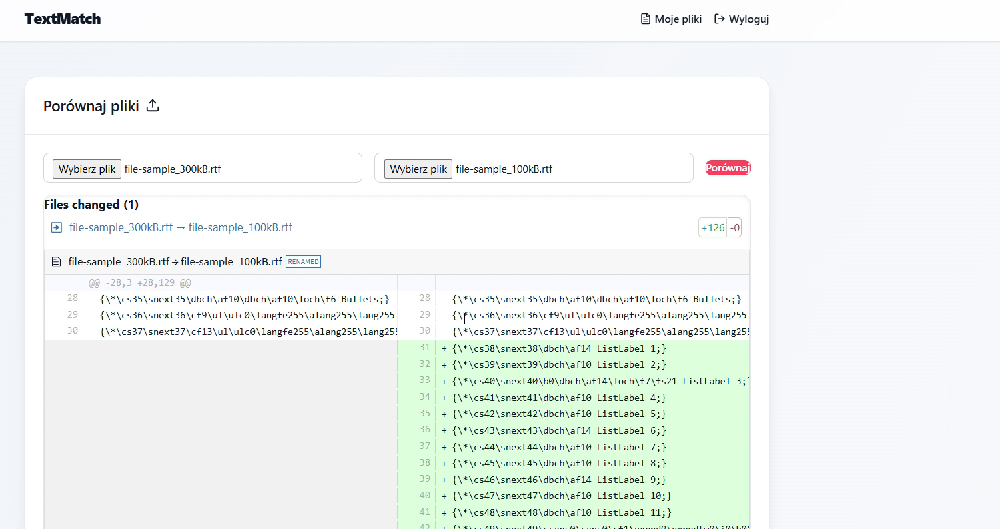
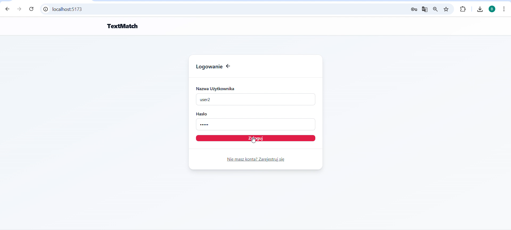

# TextMatch
**Web application to compare text content of files.**

## Table of Contents

- [About the Project](#about-the-project)
- [SAST in Project](#sast-in-project)
- [Usage](#usage)
- [Requirements](#requirements)

## About the Project

**Screeenshots** of navigating through app:

**- **
**- **

TextMatch is a web application used to compare and identify differences in the textual content of different types of files. Accepted file extensions include: **.py, .md, .sh, .txt**.

The backend of the application was written in **Python** using the **Flask** framework. The application communicates through an API with an encrypted connection to a database created in MySQL, which is statically encrypted.

The frontend of the application was written in **JavaScript** using the **React** tool.

## SAST in Project

This project features a comprehensive CI pipeline that integrates multiple **SAST tools** to detect potential security vulnerabilities early in the development lifecycle:

**CodeQL**: Performs deep static analysis on both Python and JavaScript codebases to identify a wide range of security vulnerabilities, such as injection flaws, data leaks, and unsafe API usage. Results are uploaded to GitHub's Security tab via SARIF reports.

**Semgrep**: Complements CodeQL with fast, rule-based static analysis using open-source and custom security rules. Outputs are also published as SARIF reports for centralized visibility.

These tools run on each push to main, as well as on every pull request, ensuring that new code is continuously scanned and evaluated for security risks before merging.

The CI also includes **SCA (Software Composition Analysis)** for Python and Node.js to detect known vulnerabilities in dependencies, further strengthening the project’s security posture.

## Usage
App can be used in order to verify whether there is any difference in text content between two files and indentifies the differences and their place.

## Requirements

Requirements for running the app are stored in the **requirements.txt** file.

